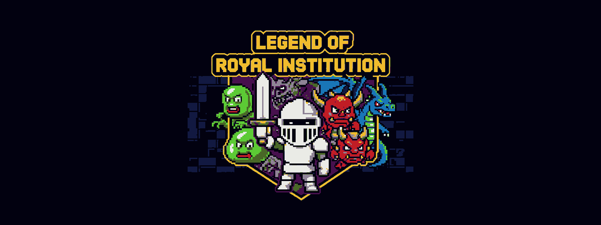
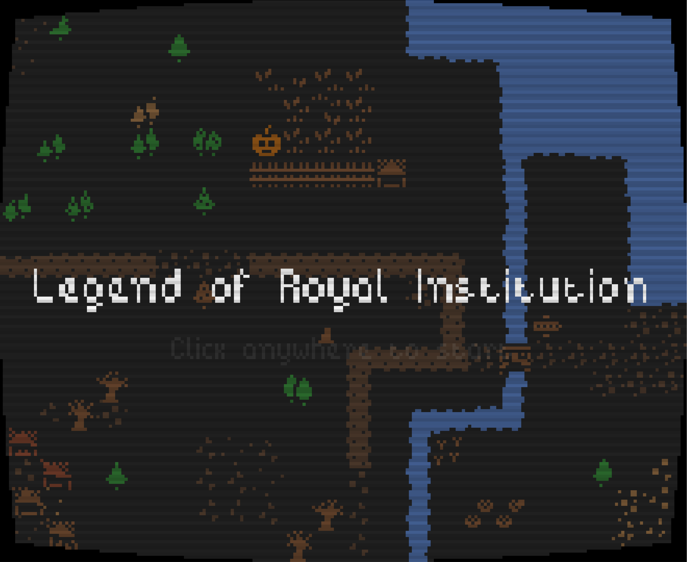
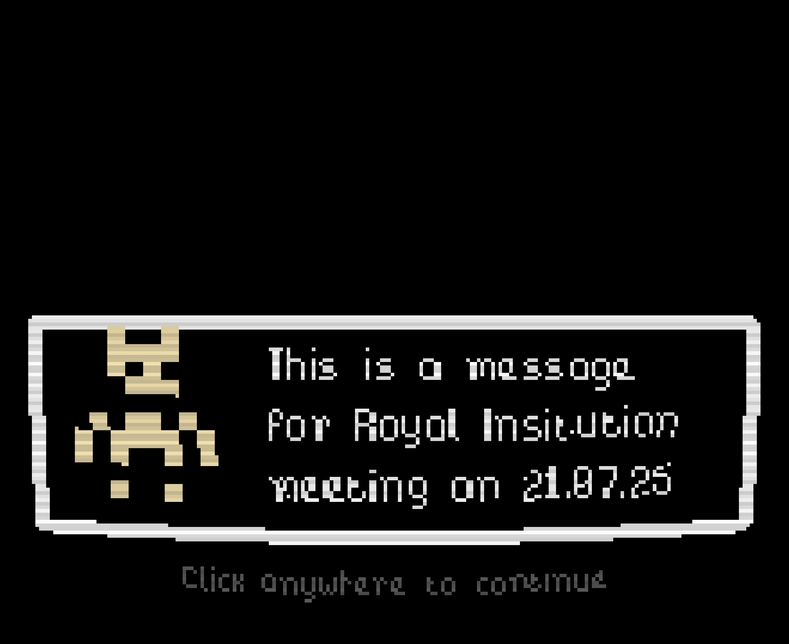
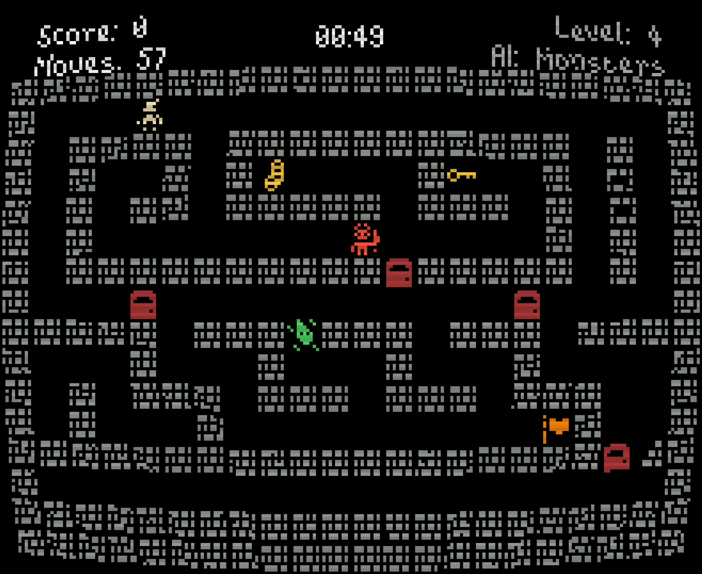
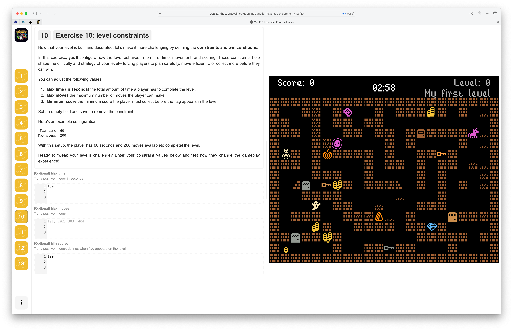
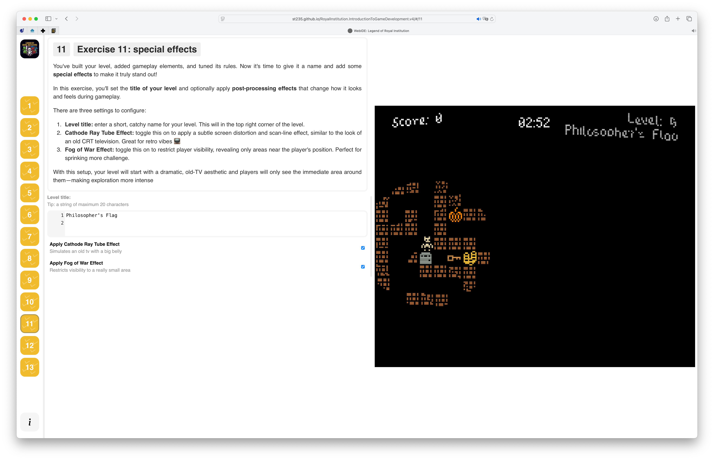
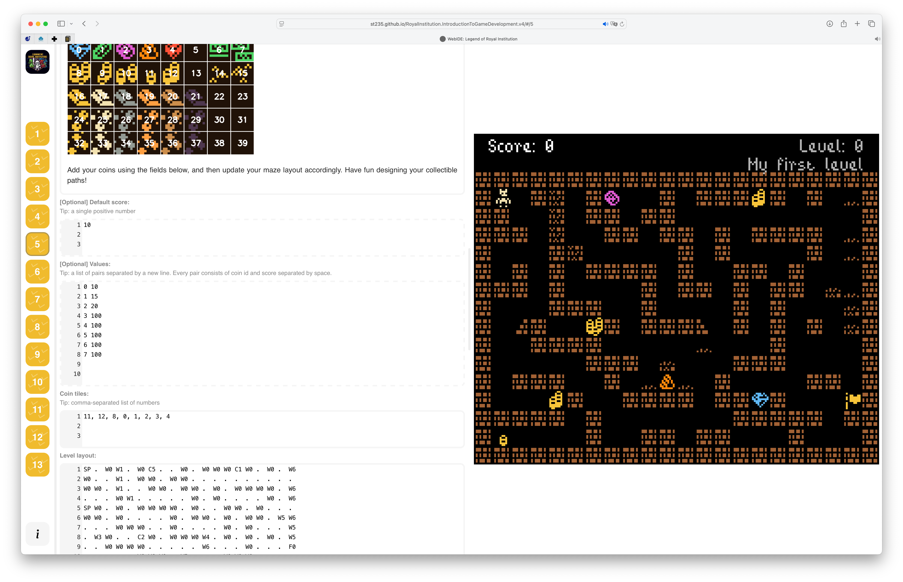

# Legend of Royal Institution: WebIDE

Welcome to the **Legend of Royal Institution Online IDE**,
an educational tool designed for introducing students to the world of game development through a hands-on,
text-configurable maze game.

This project is used in workshops delivered in collaboration with [the **Royal Institution**](https://www.rigb.org)
and built to demystify how games are made - from gameplay mechanics to level design and AI behavior.

## Workshop Learning Plan

#### 1. What Makes Up a Video Game?
- **Gameplay** – How the player interacts with the game.
- **Mechanics** – The rules and systems (e.g., keys open doors, coins increase score).
- **End Goal** – What does it mean to win or finish the game?

#### 2. Playthrough & Analysis
- Play the sample maze and try to understand its rules.
- Brainstorm 2–3 mechanics you'd like to add that aren't in the game yet.

#### 3. Building a Custom Level
- Learn about config/data-driven design.
- Understand wall configuration and layout logic.
- Create your own tile config.
- Design your own maze.

#### 4. Adding Mechanics
- Revisit mechanic ideas and choose a few to implement.
- Add coin tiles.
- Assign different point values to different coins.
- Introduce doors and keys.

#### 5. Design Challenge
- Place doors and keys in a way that makes the level interesting.
- Refine and test a custom labyrinth.

#### 6. Thinking About AI
- What would a monster do? Where would it go?
- Prototype custom monster behavior in text config.

#### 7. Misc – Spice It Up!
- Add easter eggs or secret levels.
- Add additional constraints like a move limit, timer, or collectibles challenge.

### Educational Goals

By the end of this workshop, students will:

- Understand the structure of a video game
- Modify game mechanics and level design using data/config files
- Explore how games respond to user input and rules
- Experiment with AI-like behavior and gameplay balance
- Express creativity through level building and gameplay tweaks

## Getting Started

### Stack

- **Game Engine:** [Phaser 3](https://phaser.io/)
- **Frontend:** TypeScript + React + Redux

### Local Development

```bash
npm install
npm run dev
```

> [!TIP]
> Open your browser at [http://localhost:5173/RoyalInstitution.IntroductionToGameDevelopment.v4](http://localhost:5173/RoyalInstitution.IntroductionToGameDevelopment.v4)
> to see the Web IDE running.

### Run Lint, Tests, and Build

Before pushing changes:

```bash
npm test
npm run lint
npm run build
```

> [!TIP]
> CI must be green to contribute!

## Screenshots

### Game

| Title | Dialog system | Maze |
| ---- | ---- | ---- |
|  |  |  |

### Web IDE

| Constraints | Special Effects | Coins |
| ---- | ---- | ---- |
|  |  |  |


Created with ❤️ for the Royal Institution.
